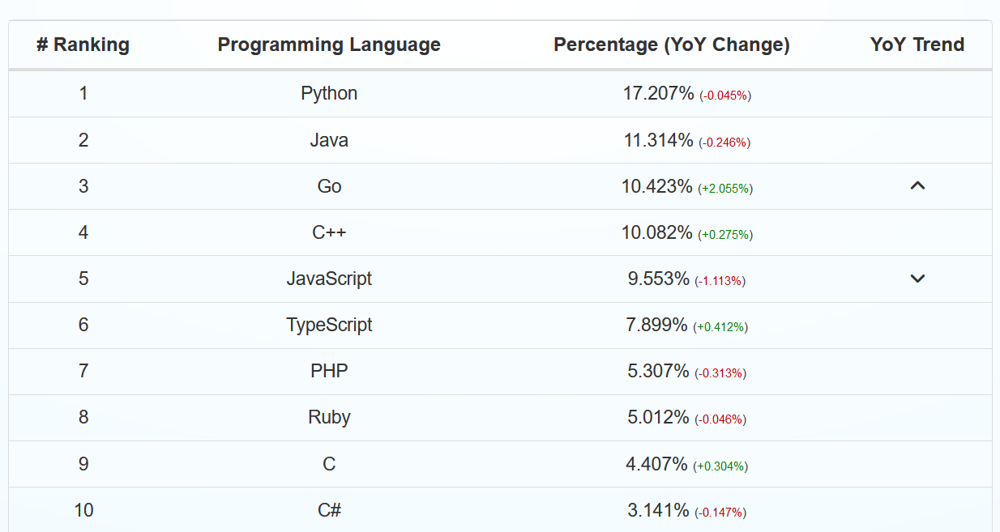

## Team Stone Wiki 1 - Evolution of C++ Programming Language

The C++ programming language was the brainchild of Danish computer scientist, Bjarne Stroustrup. In his own words, Stroustrup describes C++ as “a general-purpose programming language with a bias towards systems programming that is a better C, supports data abstraction, supports object-oriented programming, and supports generic programming” [1]. To elaborate on this description, Stroustrup says that “C++ is a language for defining and using light-weight abstractions [that] has significant strengths in areas where hardware must be handled efficiently and there is significant complexity to cope with” [1]. In other words, C++ is an evolution of the C language that incorporates the “low level” programming of hardware and the more human friendly “high level” programming paradigm that utilizes data abstraction and OOP. Stroustrup conceptualized this “best of both worlds” approach to programming as a graduate student at the University of Cambridge, in the mid to late 1970’s [2]. Stroustrup says he invented C++ because he wanted to “design a language in which [he] could write programs that were both efficient and elegant [because up until then] most languages force you to choose between these two alternatives” [3]. The C++ language was created by incorporating the “elegant” object-oriented “styles encouraged by [the programming language] Simula67” into the “efficient” system programming of C [3]. 

 

*Bjarne Stroustrup at Bell Labs*

The C++ programming language as we know it today evolved from Stroustrup’s earlier work on a language called “C with Classes” which he developed from 1979 to 1983 at the Computing Science Research Center of Bell Laboratories in Murray Hill, New Jersey [2]. In 1983, “C with Classes” was renamed to “C++” (as a play on words using the ++ increment operator from C) and was released internally for the first time. Two years later in 1985, C++ became commercially available outside of Bell Laboratories [3]. By the end of the 1980’s, C++ was gaining in popularity and so Stroustrup saw the need to begin the formal standardization process for C++ (which was finalized in 1998 and has been updated roughly every three years since) [2]. The rapid adoption of the C++ programming language popularized the object-oriented paradigm (that began with Simula67) and paved the way for contemporary OOP languages such as Java. 

C++ offers several advantages over other popular languages such as its high performance, memory management, library support, and portability. As a compiled language, C++ generates fast and efficient code, rendering it ideal for performance-intensive applications. C++ also provides a diverse range of memory management options, allowing developers to choose between manual management using pointers or automatic management using smart pointers and garbage collection libraries. Moreover, the language has a broad standard library that encompasses a variety of data structures and algorithms, which can simplify the creation of intricate programs. Finally, C++ can be compiled and executed on multiple platforms including various embedded systems [5].

The language is not without its drawbacks though. It's important to consider its overall complexity, lower level of safety, and longer compilation times. Due to its intricate nature some of the previously mentioned advantages can take a considerable amount of time to learn. C++'s syntax is often considered verbose and challenging to comprehend, which also presents a steep learning curve for new and intermediate users. Furthermore, C++ allows pointer arithmetic and direct memory access, which can result in bugs and security vulnerabilities. Lastly, compiling C++ code takes longer than other programming languages, which may hinder the development process.

C++ is often compared to other OOP programming languages such as Java but the similarities often end with syntax. Other than that, they are different in platforms, memory management, speed performance, and popular uses. While Java programs can run on any platform they use Java Virtual Maching (JVM), C++ programs by comparison must be compiled separately for each platform they will run on. C++ offer low-level memory management features such as pointers, while Java has automatic garbage collection to manage memory. Speaking of speed, C++ programs can generally run faster than Java programs because C++ programs can directly access hardware resources, while Java programs run on top of the previously mentioned JVM, which adds a layer of abstraction. Finally, C++ is commonly used for systems programming, embedded systems, and game development, while Java is commonly used for web applications, enterprise software, and Android app development [6].

C++ was developed to be an extension of the C language that also had support for objects. This allowed for real-life analogies to be included in programming. In an interview with Stroustrup, when asked about his initial motivation behind designing C++, he stated, “I wanted to build a multi-computer system with a communication system that could be either shared memory or a network. My focus was on the software.” To do this, he needed to “write low-level, close-to-hardware code, such as memory managers, process schedulers, and device drivers”[4] and “separate software components so that they could be running on separate computers communicating in well-defined ways.”[4] Since there was no language that could do both, he decided to create his own.[4] C++ or C with programming languages is a general-purpose language. It shows up just about everywhere, from gaming, GUI applications, web browsers, operating systems, to even the creation of other programming languages. It is also widely used in embedded systems because it is a mid-level language, which provides users with much more control over the system without having to deal with the complexity of lower-level languages.

Despite being as old as it is C++ is still in great demand and is nowhere near being a legacy language. In fact, its applications and uses have grown to include new technologies along with those its commonly associated with. The reason C++ is still around when other languages come and go is largely because it does not belong to a corporation and its almost completely compatible with C. C is a low-level language, while C++ is a mid-level language. This makes C++ being compatible with C very versatile, allowing people almost the same control that comes with low-level languages while keeping some features that belong to high-level languages.[4] C++ has also been constantly evolving, incorporating the most advanced and new computer techniques, which allows it to have a modern feel. Another fact that contributes to the popularity of C++ is that throughout all of its evolution, it always ensures to continue compatibility with its older versions.[4]

If we look at the robust history and current state of C++ we can speculate on its relevance and future. C++ has been in constant development for the past 40+ years and shows no sign of slowing down. When you navigate the organization’s official website you can find it full of very recent updates and links to future events. You can also find links to their their project on github, which has regular updates and active contributors. The site also has a current status page that provides a timeline of major feature updates and a road map of currently planned updates leading into next year[8]. This level of planning and messaging not only signals that C++ is still widely used but continuing to thrive despite new more accessible languages driving emergent technologies, such as A.I. When you search the internet for terms like “most popular programming languages” you will find an overwhelming number of blogs, academic articles and newsletters listing C++ as 'in demand'. This is supported by popularity trends and tracking of github projects.

As you can see in the image above C++ is in the top 5 and also gaining popularity (as of April 2023). This is probably due to the aforementioned features of the language but also the landscape of technology it helps drive. With embedded systems getting smaller and more complex developers would want to fully harness their software and eek out as much performance as they can.  It’s unlikely that C++ will will become obsolete any time soon. Instead it seems more likely that C++ will continue to evolve in the way it has for the last few decades by implementing new features. If C++ were ever to become obsolete it would probably be due to some ground breaking technological leap that made all of OOP obsolete with it.

 [7]

### References

[1] B. Stroustrup. “The C++ Programming Language.” stroustrup.com. https://www.stroustrup.com/C++.html. [Accessed 4-15-2023]. 

[2] B. Stroustrup. “A History of C++: 1979-1991.” stroustrup.com. https://www.stroustrup.com/hopl2.pdf. [Accessed 4-15-2023]. 

[3] B. Stroustrup. “Bjarne Stroustrup’s FAQ.” stroustrup.com. https://www.stroustrup.com/bs_faq.html#what-is. [Accessed 4-15-2023]. 

[4] TechRepublic interview - Bjarne Stroustrup. (n.d.). Retrieved April 16, 2023, from https://stroustrup.com/TechRepublic-interview-Bjarne-Stroustrup.pdf 

[5] N. Duggal, “What are the uses of C++ & Its Applications: Simplilearn,” Simplilearn.com, 03-Mar-2023. [Online]. Available: https://www.simplilearn.com/tutorials/cpp-tutorial/top-uses-of-c-plus-plus-programming. [Accessed: 16-Apr-2023]. 

[6] R. Meltzer, “C++ VS Java: A guide for beginners,” Course Report, 16-Nov-2022. [Online]. Available: https://www.coursereport.com/blog/c-vs-java-a-guide-for-beginners. [Accessed: 16-Apr-2023]. 

[7] “History of C++,” GeeksforGeeks, 13-Jun-2022. [Online]. Available: https://www.geeksforgeeks.org/history-of-c/. [Accessed: 16-Apr-2023]. 

[8] "Standard C++" [Online]. https://isocpp.org [Accessed: 14-Apr-2023].

[9] "Github Language Stats" [Online]. https://madnight.github.io/githut/#/ [Accessed: 14-Apr-2023]
